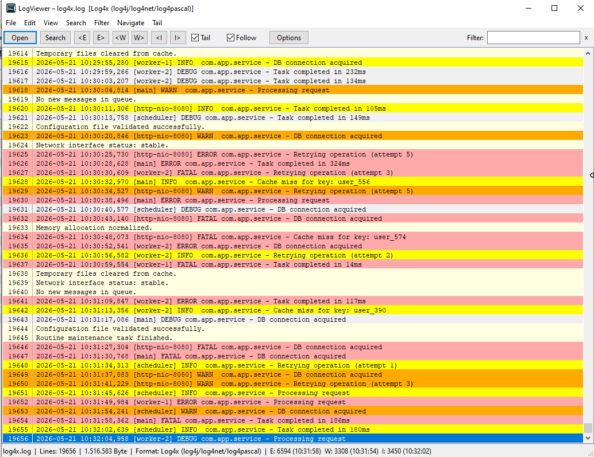
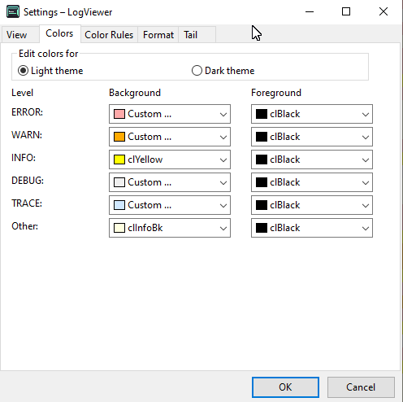

# WLX LogViewer (64-bit) for Total Commander

Fast, feature-rich log viewer plugin for **Total Commander Lister/Quick View**.

This project ports the original `TC\LogViewer` behavior to a **64-bit WLX plugin** and keeps the focus on high performance for very large log files.




## Highlights

- Native **WLX plugin** (`.wlx64`) for Total Commander
- **No LCL runtime required** (Win32 API based UI)
- Optimized for speed with large files
- Incremental tailing and filtering
- Color-aware log level visualization
- Toolbar, context menu, and options dialog aligned with the original LogViewer workflow

## Core Features

### Viewing & Navigation

- Open logs in **Lister** and **Quick View**
- Jump to:
  - Next/previous `ERROR`
  - Next/previous `WARN`
  - Next/previous `INFO`
  - **Line number**
  - **Date/time**
- Optional **line numbers** with configurable digit width
- Vertical separator line between line number and log text
- **Word wrap** mode

### Search & Filter

- Quick **filter field** in toolbar (right aligned)
- Find support integrated with Lister behavior:
  - `Ctrl+F` / `F7` forwards to Lister search
  - `F3` find next
  - `Shift+F3` find previous
- Context menu actions:
  - `Copy line`
  - `Copy all visible`
  - `Line numbers`
  - `Word wrap`
  - `Go to date/time`
  - `Go to line`

### Tailing

- Live tail mode with configurable interval
- `Follow` mode to stay at end of file
- Optional **“Enable tail when opening file”**
- Non-exclusive file access (compatible with actively written logs)
- Preserves selection/current line while file updates

### Formats & Parsing

- Auto-detection and forced format support
- Parsing support includes plain logs and CSV-style formats
- Custom format options including delimiter/field-role style mapping
- Correct severity handling from dedicated severity columns (no false override from free text)

### Colors, Themes, and Rules

- Configurable colors for levels (`Error`, `Warn`, `Info`, `Debug`, `Trace`, `Custom`)
- Color preview in options (normal/dark variants)
- **Dark mode control**:
  - Auto
  - Always light
  - Always dark
- **Color Rules** (pattern-based highlighting) like in original project

### UI/UX Details

- Toolbar with original-style navigation controls
- Status bar with:
  - Lines / bytes / detected format
  - Right-aligned E/W/I stats with timestamps
  - Latest updated class emphasized (bold)
- Consistent normal-weight fonts in toolbar and popup dialogs
- ESC behavior configurable for Lister mode (`CloseOnEscInLister`, default `true`)
- Number keys `1..8` forwarded to Total Commander

## Performance Notes

The plugin is designed for large logs and responsive interaction:

- Raw log text is stored in compact shared buffers
- Fast incremental append path for tail updates
- ASCII fast-path for case-insensitive filtering
- Wrap-height caching and measurement reuse
- Word wrap rendering path focuses work on visible content

## Configuration

Settings are persisted to INI and synchronized across:

- Toolbar state
- Options dialog
- View behavior

This includes line number settings, font settings, wrap mode, theme mode, tail settings, and color rules.

## Build

### Requirements

- Lazarus / Free Pascal with Win64 target
- Total Commander WLX SDK units (already included in this project)

### Build Command

```powershell
C:\Users\Alexander\lazarus\lazbuild.exe LogViewerPlugin.lpi
```

Build output:

- `LogViewer.wlx64`

## Install in Total Commander

1. Open Total Commander configuration for **Plugins > Lister (WLX)**.
2. Add `LogViewer.wlx64`.
3. Associate it with desired extensions (e.g. `.log`, `.txt`, `.csv`, `.json`) if needed.

## Project Structure

- `LogViewerPlugin.lpr` - plugin entry point
- `uWLXExports.pas` - exported WLX API functions
- `uWin32LogWindow.pas` - main viewer window, UI, rendering, interaction
- `uLogLoader.pas` - fast file loading
- `uLogParser.pas` - line parsing and format logic
- `uLogModel.pas` - in-memory log storage
- `uLogFilter.pas` - filter operations
- `uPluginOptions.pas` - options dialog
- `uSettings.pas` - settings/INI handling

## Compatibility

- Target: **Windows x64**
- Plugin type: **WLX (Lister)**
- Host: **Total Commander 64-bit**

